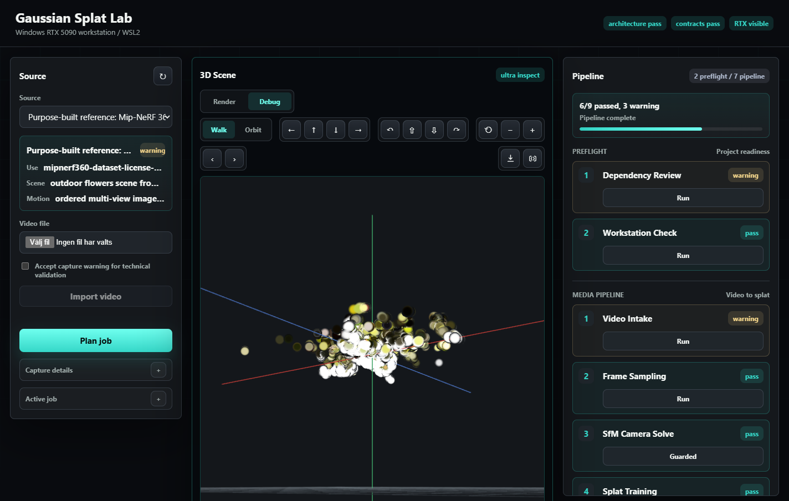
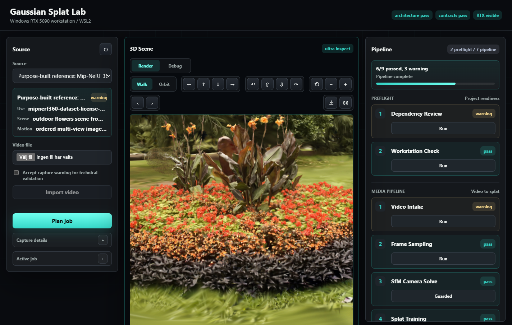

# Gaussian Splat Lab

Local video-to-3DGS reconstruction lab for an RTX workstation.

Gaussian Splat Lab is a local test bed for turning video or structured captures into interactive Gaussian Splat scenes on an RTX workstation.

The repo exists for a practical reason: we want to understand how far a Windows/WSL2 RTX 5090 machine can take us from raw capture to a navigable 3DGS scene, with enough evidence along the way to debug quality, exports and future product use.

This is meant to be inspectable work, not a black-box demo. Each step writes a report before the next step uses its output. That discipline matters because 3DGS quality can fall apart for ordinary reasons: weak capture data, poor camera poses, the wrong training profile, unclear source rights or a viewer that hides rendering mistakes.

## Current Status

Status: working local pipeline with browser viewer.

Current local-video reference job:

`outputs/jobs/capture-video-20260619T103507Z-20260619T103515Z`

Current best-quality trainer result from that capture:

- profile: `splatfacto_reference`
- trainer: Nerfstudio Splatfacto
- splats: `246,863`
- PLY size: `59 MB`
- eval: PSNR `28.48`, SSIM `0.921`, LPIPS `0.095`
- renderer: Spark + Three.js Gaussian Splat viewer
- navigation: Walk, Orbit, mouse-look, wheel zoom, reference cameras and debug point-cloud mode
- export: streamed PLY and viewer-manifest download

The quality report may still be `warning` because the current public reference capture and some commercial-use evidence are not product-ready. That is useful signal rather than a broken run; training, packaging and viewer validation pass for the active technical reference.

## GUI Screenshots

Debug point-cloud inspection view:



Rendered 3DGS view from the active `rtx_ultra_quality` splat:



These screenshots are paired on purpose: Debug mode shows the sampled point cloud, while Render mode shows the Gaussian Splat scene users actually navigate.

## Why This Project Exists

The product goal is straightforward: a dependable path from capture media to an interactive 3D environment. For this project, that means:

- video-first input, since video is likely to be the easiest capture format for users
- support for structured datasets, so we have clean reference material when we test quality ceilings
- local GPU execution, because reconstruction is heavy and we want to learn the real RTX workstation limits
- dependency choices we can defend if the work becomes commercial
- a simple end-user interface, so the workflow can later be run by non-engineers
- exportable scene artifacts that can be embedded, handed off or archived
- a worker-style interface that an agent can call through `swoqerd` for Swoqer-style integrations

The repo is kept apart from product code so reconstruction choices, generated artifacts, licensing checks and heavy GPU experiments stay easy to reason about.

## What It Does

Gaussian Splat Lab can now:

- track known captures in manifests
- import local videos into controlled capture paths
- extract and score video keyframes with FFmpeg/Pillow
- solve camera poses with COLMAP SfM
- train Gaussian Splats locally with PyTorch/CUDA, either through the repo-local mini `gsplat` trainer or Nerfstudio Splatfacto
- apply capture profiles that change frame sampling and COLMAP matching defaults for rooms, outdoor environments and object orbits
- run multiple quality profiles from quick probes to Splatfacto best-quality runs and heavy RTX ceiling tests
- package a binary PLY splat plus viewer manifest
- render the result in a browser with a real Gaussian Splat renderer
- switch between production render mode and debug point-cloud mode
- validate viewer navigation controls with headless Chrome
- export the active PLY and manifest from the UI

Large generated files remain outside git. The repo commits scripts, manifests, docs, configuration and screenshots; videos, extracted frames, SfM databases, checkpoints, splats and generated reports stay local.

## Pipeline

The workflow is boring on purpose: one step writes evidence, the next step reads it.

| Order | Step | What it does | Output | What we check |
| ---: | --- | --- | --- | --- |
| 1 | Framework and license review | Decide which tools are allowed and which are blocked for commercial use. | `framework_license.json` | Flags blocked, conditional and review-required dependencies. |
| 2 | Workstation check | Verify the local RTX workstation, CUDA/PyTorch visibility, COLMAP, FFmpeg and GPU baseline. | `environment.json` | Confirms RTX 5090 visibility and warns if GPU is already busy. |
| 3 | Video intake | Confirm the selected source exists and that capture quality/source rights are acceptable for the current purpose. | `intake.json` | Blocks missing files and records source/license warnings. |
| 4 | Frame sampling | Extract candidate frames across the full clip, score them for sharpness, contrast, exposure and texture, then keep the best keyframes per time segment. | `frames/`, candidate frames, frame manifest, contact sheet | Verifies frame count, hashes, video coverage, selected keyframes and capture-quality metadata. |
| 5 | SfM camera solve | Run COLMAP feature extraction, matching and mapping. | sparse COLMAP model | Verifies registered images, sparse points and model analyzer output. |
| 6 | Splat training | Train Gaussian Splats on the RTX GPU. `Best quality` uses Nerfstudio Splatfacto; debug/stress profiles use the repo-local `gsplat` trainer. | checkpoint, PLY, sample render, render-review sheet | Verifies CUDA, training completion, exported PLY and render/target review metrics. |
| 7 | Packaging | Build the browser viewer manifest around the active splat artifact. Splatfacto exports keep the original PLY for download and add a viewer-optimized PLY for browser navigation when needed. | `viewer-manifest.json` | Verifies PLY hash, size, header, viewer artifact and reference camera views. |
| 8 | Viewer validation | Confirm the local browser viewer can load the packaged artifact. | `viewer.json` | Verifies manifest, artifact hash, camera views and viewer hooks. |
| 9 | Quality report | Summarize the whole run. | `quality_report.json` | Classifies the run as usable, weak, incomplete, blocked or failed. |

Each step can be run on its own. Later steps stop when earlier ones fail, unless the warning has been reviewed and explicitly accepted.

## Quality Profiles

The upload wizard keeps the main choice short and practical. The user is choosing how much time to spend, not which internal experiment to run.

| Wizard choice | Typical full-run estimate | Use it when |
| --- | ---: | --- |
| `Standard 3DGS` | about 1h 15m | You want a normal full scene without immediately spending the longest runtime. |
| `Best quality` | about 2h 15m | You care about the best current visual result from a good video. This is the recommended path for final output right now. |
| `Quick preview` | about 27m | You only want to check that upload, frame extraction, camera solve and training work on a new video. |
| `Ceiling test` | about 3h 15m or more | You are deliberately testing how far the RTX workstation and the input video can be pushed. |

Splatfacto quality path:

- `splatfacto_big_quality`: `Best quality` in the GUI. Uses Nerfstudio `splatfacto-big`, 30k iterations, COLMAP data, downscale factor `2`, CPU image cache, PLY export and Nerfstudio eval renders. This is the current best measured user-facing path.
- `splatfacto_reference`: `Standard 3DGS` in the GUI. Uses standard Nerfstudio Splatfacto, 30k iterations and downscale factor `2`. It is lighter than `splatfacto_big_quality` and remains useful as a comparison point.
- `splatfacto_ceiling`: deliberate lab profile for finding the current quality ceiling. Uses Nerfstudio `splatfacto-big`, 30k iterations, downscale factor `1`, more COLMAP features and a longer timeout. It can run for hours on large 4K videos and should be treated as an experiment, not the default user path. A 40k full-resolution attempt hit the practical VRAM ceiling on the RTX 5090 before export.
- `splatfacto_preview`: short integration smoke profile, useful for checking that train/export/eval/package/viewer still work without waiting for a full run.

Repo-local `gsplat` debug and stress profiles:

- `smoke`: very fast sanity check
- `baseline`: first densifying profile
- `quality_probe`: faster quality inspection
- `rtx_reference`: stable RTX reference run
- `rtx_high_quality`: balanced 1.0M-splat profile
- `rtx_ultra_quality`: current best active 1.6M-splat profile
- `rtx_stable_quality`: max-stable mini-trainer profile that stays near the current 1.6M practical cap
- `rtx_ceiling_quality`: controlled 2.0M-splat lab ceiling test
- `rtx_max_quality`: heavy CLI stress profile for lab-only ceiling exploration

Current quality-ceiling results are tracked in [docs/quality-ceiling-results.md](docs/quality-ceiling-results.md). For the local Hugging Face sample video, Splatfacto produced a much cleaner eval render than simply pushing the mini-trainer to more splats. Bigger files are not automatically better: the 1.6M mini-trainer artifact is larger than the 247k Splatfacto artifact, but the Splatfacto eval render is visibly sharper and scores better on Nerfstudio metrics. The normal upload wizard now exposes `Best quality` for Splatfacto; the larger mini-trainer ceiling and stress profiles should be run deliberately from the lab/CLI when the GPU is at known-stable clocks.

## Capture Profiles

The wizard's `Capture profile` selector is not decorative. It changes the capture manifest before the job is planned, so downstream stages read different frame sampling and COLMAP settings.

| Wizard choice | What changes | Why |
| --- | --- | --- |
| `Interior room` | Balanced frame count, with stronger sequential overlap on lighter profiles. | Room captures often fail because nearby frames do not overlap enough once the path turns or crosses the room. |
| `Outdoor environment` | Higher frame budget, wider COLMAP overlap, more features and guided matching. | Outdoor paths usually cover larger distances and need more camera/feature evidence to stay registered. |
| `Object orbit` | Smaller frame budget, object-orbit matching defaults and guided matching. | Object scans should be a deliberate orbit around one subject rather than a large environment walk-through. |

`Generation strategy` is separate. It controls the trainer and quality level, while `Capture profile` controls how the video is sampled and matched before training begins.

## Capture Diagnostics And SfM Rescue

Frame sampling now does more than take every Nth frame. It first extracts a larger candidate set across the full clip, scores candidates for sharpness, contrast, exposure, clipping and texture, then keeps the best keyframes per time segment. The report records how many candidates were considered, how many were kept and whether selected frames still contain risky bright/textureless areas.

Blank white walls are a known weak spot for photogrammetry and Gaussian splats. The pipeline does not simply throw those frames away, because that would remove the wall from the scene. Instead it prefers frames where the wall is sharp and appears with useful anchors such as floor trim, corners, posters, furniture or nearby textured objects. If many selected frames are still mostly bright and textureless, frame sampling emits a warning before the heavy COLMAP/training stages.

Run CLI stages through `.venv/bin/python`, as shown below, so the Pillow-based keyframe scoring dependency is available. The GUI server already uses the venv when it launches pipeline stages.

When a video is longer than the selected frame budget, candidate extraction still spans the whole clip. This matters for room captures where one wall or floor area may only appear near the end of the video.

The SfM stage runs the configured COLMAP profile first. If too few frames register, it automatically retries with more robust matching:

- `guided-sequential-rescue`: more features, larger sequential overlap and guided matching
- `exhaustive-guided-rescue`: exhaustive guided matching for smaller frame sets

The report keeps every attempt and selects the best sparse model. If all attempts still fail, the UI surfaces the best registration result, for example `42/89 frames registered`, instead of silently stopping.

## Browser UI

Start the local UI:

```bash
python3 scripts/lab-ui-server.py --host 127.0.0.1 --port 8765
```

Then open:

```text
http://127.0.0.1:8765/
```

To reach the UI from another computer on the same local network, start the server on all interfaces:

```bash
python3 scripts/lab-ui-server.py --host 0.0.0.0 --port 8769
```

On WSL2, Windows may also need a portproxy and a private-network firewall rule. Run this from an elevated Windows PowerShell:

```powershell
.\scripts\expose-ui-lan.ps1 -Port 8769
```

If the elevated PowerShell is not opened in the repo folder, call the script through the WSL share instead:

```powershell
powershell.exe -ExecutionPolicy Bypass -File "\\wsl.localhost\Ubuntu-24.04\home\engwall\projects\gaussian-splat-lab\scripts\expose-ui-lan.ps1" -Port 8769
```

The script prints the LAN URL to open from another device, for example `http://192.168.50.212:8769/`. To remove the exposure again:

```powershell
.\scripts\expose-ui-lan.ps1 -Port 8769 -Remove
```

The UI is a local lab console with:

- a guided scene capture wizard for direct video upload
- capture profile and quality strategy selection
- automatic upload, job planning and queued stage-by-stage generation
- an editable render queue for overnight batches: queued items can be reordered, edited, cancelled or removed before they start
- a rendering modal for active jobs, with current step, elapsed time, estimated remaining time and immediate or after-current-step stop controls
- progress text, elapsed time and ETA for the full generation run
- per-step cards that explain what is happening, what the step produces and which internal checks are running
- live training progress from Nerfstudio logs when available, including iteration count and remaining time
- keyframe diagnostics during frame sampling: blur, contrast, exposure, large frame-to-frame motion and bright textureless wall risk
- automatic COLMAP retry profiles during SfM when too few frames register
- source/capture selection
- local video import controls
- live pipeline panel on the right
- central 3D scene view
- gallery page for previous packaged 3DGS environments
- `Render` mode for Spark Gaussian Splat rendering
- `Debug` mode for point-cloud inspection
- `Walk` and `Orbit` navigation
- reference camera stepping
- collapsible lower-priority metadata
- active PLY and viewer-manifest export buttons

Viewer controls are validated by:

```powershell
.\scripts\validate-viewer-controls.ps1 -Url "http://127.0.0.1:8765/"
```

The upload wizard can be checked end to end with a real video:

```bash
.venv/bin/python scripts/validate-wizard-api-e2e.py http://127.0.0.1:8765 \
  --video <path-to-test-video.mp4> \
  --scene-name "Wizard API E2E room" \
  --quality quality_probe
```

There is also a browser/CDP version for environments where Chrome or Edge DevTools is reachable from WSL:

```bash
.venv/bin/python scripts/validate-wizard-upload-e2e.py http://127.0.0.1:8765/ \
  --video <path-to-test-video.mp4> \
  --scene-name "Wizard browser E2E room" \
  --quality quality_probe
```

## Export Model

The primary export today is a viewer environment bundle:

- binary little-endian Gaussian Splat PLY
- optional viewer-optimized PLY for browser rendering
- viewer manifest
- reference camera views
- preview and render-review images

This is not a triangle mesh or GLB export yet. The current goal is high-quality Gaussian Splat viewing and handoff. Mesh conversion or GLB packaging can be added later as a separate export stage if product needs require it.

## Cleanup

3DGS runs leave useful but heavy working data behind: sampled frames, COLMAP databases, Nerfstudio checkpoints, TensorBoard logs and extra eval renders. The gallery only needs the packaged viewer/export files plus manifests.

Preview a cleanup plan without deleting anything:

```bash
python3 scripts/cleanup-generated-data.py --all-safe --write-report
```

Apply that plan:

```bash
python3 scripts/cleanup-generated-data.py --all-safe --apply --write-report
```

`--all-safe` removes `outputs/deleted-jobs`, removes duplicate trainer workspaces under `outputs/experiments`, and prunes gallery jobs while keeping packaged PLY exports, viewer manifests, reports and referenced preview images. Use the narrower flags (`--purge-deleted-jobs`, `--purge-experiments`, `--prune-gallery-workdirs`) when you want smaller, more deliberate cleanup.

## Licensing and Commercial Use

This repo tracks commercial-use risk, but it is not a legal opinion. The pipeline records framework and capture-source notes so we do not accidentally build product work on non-commercial code or unclear media.

Current rules:

- do not use the original GraphDeco/Inria Gaussian Splatting implementation for commercial product work without explicit permission
- prefer permissive components such as `gsplat`, PyTorch, Three.js and Spark where their licenses and notices can be managed
- use FFmpeg and COLMAP as local/system tools until redistribution details are reviewed
- treat benchmark datasets and stock videos as technical validation inputs unless commercial-use evidence is attached
- prefer self-captured or explicitly cleared media for product demos

Relevant docs:

- [docs/framework-evaluation.md](docs/framework-evaluation.md)
- [docs/commercial-compliance.md](docs/commercial-compliance.md)
- [docs/installation-and-revert-ledger.md](docs/installation-and-revert-ledger.md)

## Where Swoqer Fits

The reconstruction work is separated from any product backend so it can later sit behind [swoqer.com](https://swoqer.com/).

Swoqer is the identity-based integration platform. Gaussian Splat Lab would not be the user-facing integration layer; it would be the local or remote worker that turns an authorized video or dataset into 3DGS artifacts.

A typical flow would look like this:

1. An external service or user identity sends large dataset/video payloads through Swoqer.
2. Swoqer authorizes, routes and tracks that integration event.
3. Swoqer wakes or addresses an AI agent with the dataset/video context.
4. The agent talks to `swoqerd` on a capable workstation or worker node.
5. `swoqerd` starts a Gaussian Splat Lab job with the supplied video/dataset.
6. Gaussian Splat Lab runs intake, frame sampling, SfM, splat training, packaging and viewer validation.
7. The generated 3DGS artifacts are returned: PLY splat, viewer manifest, diagnostics and quality reports.
8. The calling service can use those artifacts as an interactive 3D environment or hand them to another agent/application.

Put another way: Swoqer handles identity, routing, large-file handoff and agent activation. Gaussian Splat Lab handles the reconstruction job and leaves behind the evidence needed to inspect what happened.

That wiring is not implemented in this repo yet. The current work is to make the worker side reliable: given a capture, run the 3DGS job, produce artifacts, and leave enough diagnostics to debug quality and licensing later.

## Key Commands

Basic checks:

```bash
./scripts/validate-architecture-contracts.sh
./scripts/validate-phase-1-contracts.sh
./scripts/validate-ui-contracts.sh
npm run check:js
```

Validate the current COLMAP fallback or a side-by-side CUDA candidate:

```bash
python3 scripts/validate-colmap-binary.py --binary /usr/bin/colmap

# Optional, after the sidecar build prerequisites in INSTALL.md are installed:
./scripts/build-colmap-cuda-sidecar.sh

python3 scripts/validate-colmap-binary.py \
  --binary "$(pwd)/outputs/tools/colmap-cuda/bin/colmap" \
  --allow-gpu \
  --qt-offscreen
```

Only set `GSL_COLMAP_BIN` after that sidecar validation passes. The default remains `/usr/bin/colmap`, which is the known-good CPU fallback.

Start the UI with GPU SfM enabled:

```bash
GSL_COLMAP_BIN="$(pwd)/outputs/tools/colmap-cuda/bin/colmap" \
  python3 scripts/lab-ui-server.py --host 0.0.0.0 --port 8769
```

List captures:

```bash
.venv/bin/python scripts/lab-pipeline.py list-captures --capture-manifest data/manifests/captures.example.json
```

Import a local video:

```bash
.venv/bin/python scripts/lab-pipeline.py import-video \
  --capture-id <capture-id> \
  --input <local-video> \
  --accept-warning \
  --overwrite
```

Run a pipeline stage:

```bash
.venv/bin/python scripts/lab-pipeline.py run-stage <stage-id> \
  --job outputs/jobs/<job-id>/job.json \
  --accept-warning
```

Run heavy splat training on purpose:

```bash
.venv/bin/python scripts/lab-pipeline.py run-stage splat_training \
  --job outputs/jobs/<job-id>/job.json \
  --accept-warning \
  --allow-heavy \
  --training-profile rtx_ultra_quality
```

Run the current best-quality Splatfacto path on purpose:

```bash
.venv/bin/python scripts/lab-pipeline.py run-stage splat_training \
  --job outputs/jobs/<job-id>/job.json \
  --accept-warning \
  --allow-heavy \
  --training-profile splatfacto_big_quality
```

Run the heavier ceiling profile when the workstation can be left busy for several hours:

```bash
.venv/bin/python scripts/lab-pipeline.py run-stage splat_training \
  --job outputs/jobs/<job-id>/job.json \
  --accept-warning \
  --allow-heavy \
  --training-profile splatfacto_ceiling
```

## Machine Topology

Primary lab machine:

- Windows workstation
- WSL2/Linux-first reconstruction runtime where practical
- NVIDIA RTX 5090
- CUDA/PyTorch/gsplat training
- local COLMAP and FFmpeg
- local browser viewer

Mac:

- optional documentation or lightweight editing machine
- not the assumed reconstruction runtime
- no CUDA/NVIDIA assumption

## Documentation Map

- [INSTALL.md](INSTALL.md): setup order, required software, validation and rollback
- [docs/mvp-pipeline.md](docs/mvp-pipeline.md): MVP workflow contract
- [docs/stable-pipeline-build-plan.md](docs/stable-pipeline-build-plan.md): stable workflow build plan
- [docs/pipeline-gates.md](docs/pipeline-gates.md): checks between pipeline steps
- [docs/end-user-ui.md](docs/end-user-ui.md): UI behavior and responsibilities
- [docs/quality-ceiling-results.md](docs/quality-ceiling-results.md): current quality-ceiling measurements
- [docs/rtx-workstation-setup.md](docs/rtx-workstation-setup.md): workstation setup notes
- [docs/psu-replacement-test-runbook.md](docs/psu-replacement-test-runbook.md): heavy-test runbook
- [AGENTS.md](AGENTS.md): working instructions for coding agents in this repo
